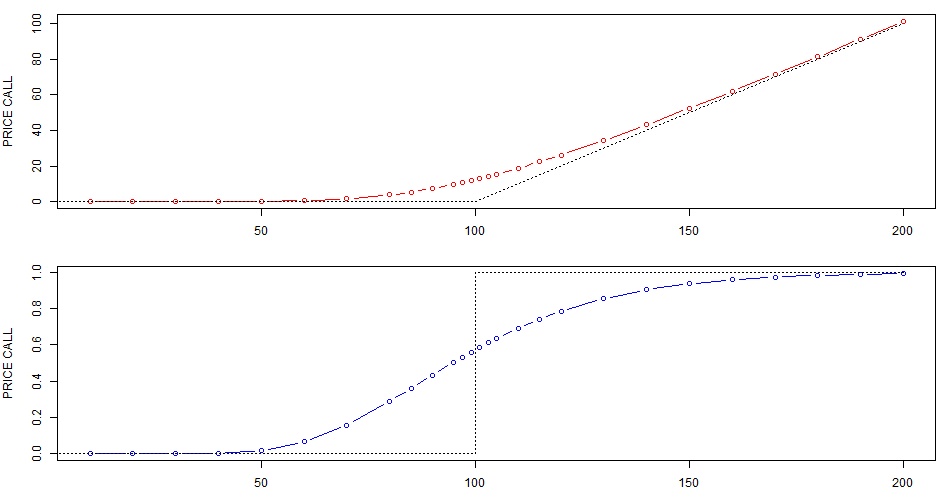

## Application overview

1. Ability to value options and visualize prices and first order derivatives (greeks) over a wide range of underlying asset price   
  
  

2. Links to wikipedia pages on options and Black-Scholes   
   
   

3. Ability to play with all releveant pricing parameters, in particular volatility  

--- .class #id 

## Default settings
1 year European call option struck at 100, with volatility of 30% and interest rate of 1%:  
 

---
## Advantages 

1. The application is hosted on a R-studio [shiny server] (https://bdivet.shinyapps.io/ShinyApp/) and does not have any dependency  

2. It is a good interactive tutorial on [options]  (http://en.wikipedia.org/wiki/Option_%28finance%29)

---
## Thank you
for your attention

Useful links to [Slidify] (http://www.slidify.org/) website and to the Coursera course on [Developing Data Products] (https://class.coursera.org/devdataprod-002)  

